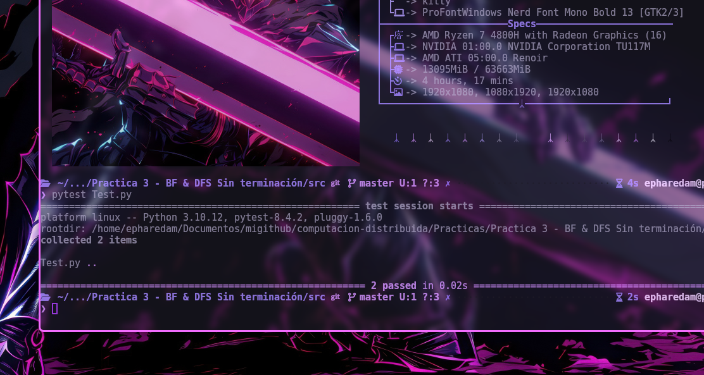

# Practica 3: BF & DFS Sin terminación

## Profesor : Mauricio Riva Palacio Orozco
## Ayudantes:
- Adrián Felipe Fernández Romero
- Alan Alexis Martínez López
<p>

## Integrantes:
- Carbajal Galicia Hilda Joana -318087223\\
- Fuentes Ortega Diego Tonatiuh -320067660\\
- Blancas Ochoa Alan -316227364\\

## Tabla de Contenidos
- [1. Introducción](#1-introducción)
- [2. Uso](#2-uso)
- [3. Estructura de la práctica](#3-estructura)
- [4. Explicación de la implementación](#4-implementacion)

## **1. Introducción**
En esta práctica implementamoas los algortimos dfs y bfs en sus versiones que no detectan terminacion usando de guía el pseudocódigo que se nos dío en la carpeta práctica 3.

## **2.Uso**
- Generamos el entorno virtual

```bash
python3 -m venv venv
```
- Activamos el entorno:
```bash
 source venv/bin/activate
```
- Paquetes:
```bash
pip install -r requirements.txt
```
- Ejecutar Tests con:
```bash
pytest Test.py
```


## **3. Estructura**
En una terminal: 
```bash
tree -I 'node_modules|cache|test_*|__pycache__|.pytest_cache|venv'
```
```
├── Canales
│   ├── Canal.py
│   └── CanalRecorridos.py
├── NodoBFS.py
├── NodoDFS.py
├── Nodo.py
├── README.md
├── requirements.txt
└── Test.py
```

## **4. Implementación**

### BFS (NodoBFS.py)

El algoritmo construye un árbol BFS desde el nodo distinguido con ID = 0.

1. **Inicialización del nodo distinguido:**
   - El nodo 0 se establece como su propio padre
   - Inicializa su nivel y distancia en 0
   - Calcula cuántos mensajes BACK debe esperar con su número de vecinos
   - Envía el mensaje `("GO", 0, 0)` a todos sus vecinos con el nivel actual

2. **Recepción del primer Go:**
   - Cuando un nodo sin padre recibe `GO(d)` del nodo j:
     - Establece a j como su padre `self.padre = j` 
     - Inicializa su lista de hijos como vacía
     - Establece su nivel como `d+1`
     - Calcula vecinos a quienes reenviar (todos excepto a su padre)
     - Establece un contador de mensajes esperados

3. **Propagación de Go:**
   - Cuando hay varios vecinos a explorar:
     - Envía el mensaje `("GO", self.id_nodo, self.nivel)` a los vecino no explorados
     - Espera los mensajes de respuesta `(BACK)`
   - Cuando es una hoja:
     - Envía el mensaje `("BACK", self.id_nodo, "yes", self.nivel)` a su padre
   - Si un nodo con padre recibe un GO con un nivel menor `lelve_i > d+1`:
     - Actualiza a su padre con el nuevo emisor porque hay un camino más corto
     - Reinicia su lista de hijos
     - Actualiza su nivel a `d+1`
     - Recalcula a sus vecinos y reenvía los GO
   - Si un nodo con padre recibe un GO con un nivel mayor o igual:
     - Envía el mensaje `("BACK", self.id_nodo, "no", d+1)` a su padre para rechazar

4. **Recepción de Back:**
   - Cuando reciba `BACK(resp, d)` del nodo j:
     - Verifica que el nivel sea correcto `d = self.nivel + 1`
     - Si `resp = "yes"` agrega a j a su lista de hijos
     - Decrementa el contador de mensajes esperados
     - Si ya recibió todos los BACK esperados y no es la raíz, envía 
    `("BACK", self.id_nodo, "yes", self.nivel)` a su padre y si es la raíz se acaba la ejecución

5. **Terminación:**
   - El algoritmo termina cuando el nodo 0 ha recibido todos los BACK
   - Cada nodo conoce su nivel, padre e hijos en el árbol BFS

### DFS (NodoDFS.py)

El algoritmo construye un árbol DFS desde el nodo distinguido con ID = 0.

1. **Inicialización del nodo distinguido:**
   - El nodo 0 se establece como su propio padre
   - Se marca como visitado en su conjunto `visitados`
   - Selecciona el vecino con menor ID (siguiendo orden determinístico)
   - Envía el mensaje `("GO", 0, [0])` al vecino seleccionado
   - Marca ese vecino como su hijo

2. **Recepción de Go:**
   - Cuando recibe `GO(visited)` del nodo j:
     - Establece a j como su padre `self.padre = j`
     - Actualiza su conjunto de visitados con los nodos recibidos
     - Se agrega a sí mismo al conjunto de visitados
     - Calcula vecinos no visitados `neighbors_i \ visited`

3. **Exploración en profundidad:**
   - Cuando todos los vecinos ya están visitados:
     - Envía el mensaje `("BACK", self.id_nodo, visitados)` a su padre
     - Establece su lista de hijos como vacía (es una hoja)
   - Cuando hay vecinos no visitados:
     - Selecciona el vecino no visitado con menor ID
     - Envía el mensaje `("GO", self.id_nodo, visitados)` a ese vecino
     - Establece ese vecino como su único hijo actual

4. **Recepción de Back:**
   - Cuando recibe `BACK(visited)` del nodo j:
     - Actualiza su conjunto de visitados con los nodos recibidos
     - Calcula vecinos no visitados con la información actualizada
     - Si todos los vecinos están visitados y es la raíz `parent_i = i`, termina el algoritmo
     - Si todos los vecinos están visitados y no es la raíz, envía el mensaje 
     `("BACK", self.id_nodo, visitados)` a su padre
     - Si hay vecinos no visitados:
       - Selecciona el siguiente vecino no visitado con menor ID
       - Envía el mensaje `("GO", self.id_nodo, visitados)` a ese vecino
       - Agrega ese vecino a su lista de hijos (expansión del árbol)

5. **Terminación:**
   - El algoritmo termina cuando el nodo 0 recibe BACK con todos los nodos visitados
   - Cada nodo conoce su padre y la lista de hijos en el árbol DFS